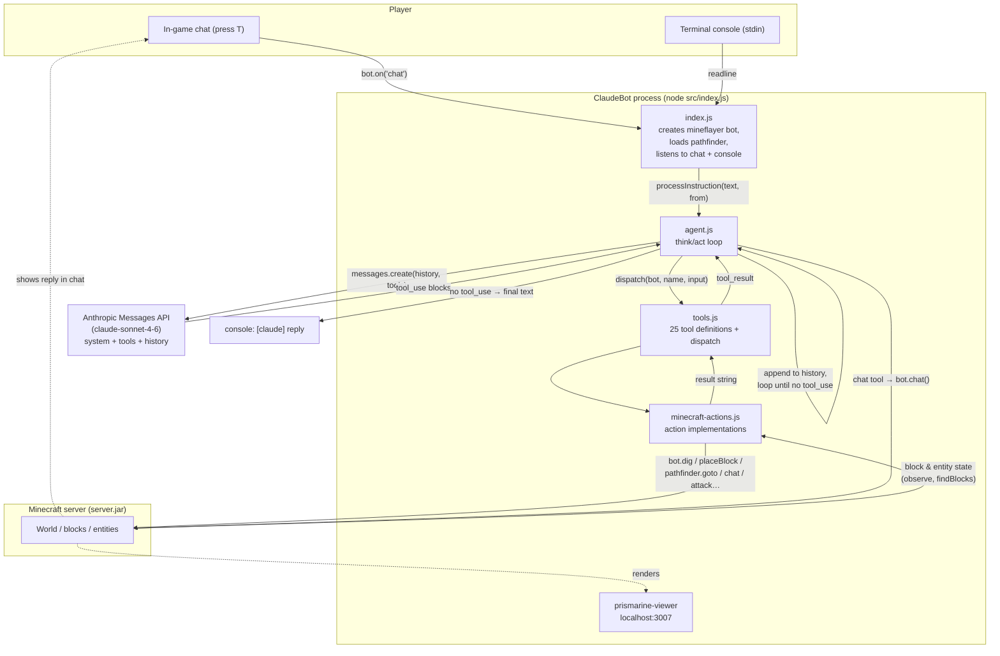

# Architecture

How MineCrawler-Claude lets Claude control a Minecraft character.

## How it works

1. **Two input paths** — in-game chat (`bot.on('chat')`) and the terminal console
   (`readline`), both feeding `agent.processInstruction`.
2. **The think/act loop** (`agent.js → handle`): send conversation history + tool
   definitions to the Anthropic API → it returns `tool_use` requests → `dispatch`
   runs the matching action against the mineflayer bot → the result string goes back
   into history → repeat until the model stops calling tools and emits a final reply.
3. **Preemption**: a new instruction bumps `runId`, aborts the in-flight API call, and
   clears the pathfinder goal — so a new command *abandons* the current one instead of
   queuing behind it. History is committed only as matched `tool_use`/`tool_result`
   pairs, and `rollbackToStable()` cleans any dangling turn left by an interrupt.
4. **Perception** — `observe`/`findBlocks` read world state (position, facing,
   inventory, nearby entities, notable blocks) back *from* the world; actions like
   `digBlock`/`placeBlock`/`pathfinder.goto` write *to* it.
5. **Viewer** — `prismarine-viewer` renders the world at `localhost:3007`, independent
   of the LLM loop.

## Files

| File | Responsibility |
| --- | --- |
| `src/index.js` | Connects the mineflayer bot, wires chat/console input, starts the viewer |
| `src/agent.js` | Anthropic think/act loop, preemption, conversation history |
| `src/tools.js` | Tool schemas exposed to Claude + `dispatch` to actions |
| `src/minecraft-actions.js` | Concrete bot actions (move, mine, build, fill, fight, craft, perceive…) |
| `scripts/start-server.mjs` | Launches the local Minecraft server |
| `scripts/smoke-test.js` | Non-destructive in-world check that every action runs |
</content>
